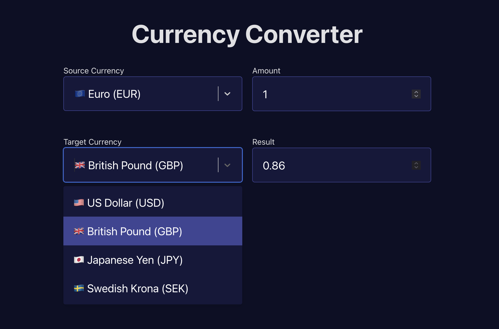

# Currency converter app with different front-end frameworks

A simple currency converter to test the differences between popular JavaScript frontend frameworks.

Done:

- [x] [React](./react)

TODO:

- [ ] Svelte
- [ ] Vue
- [ ] Angular
